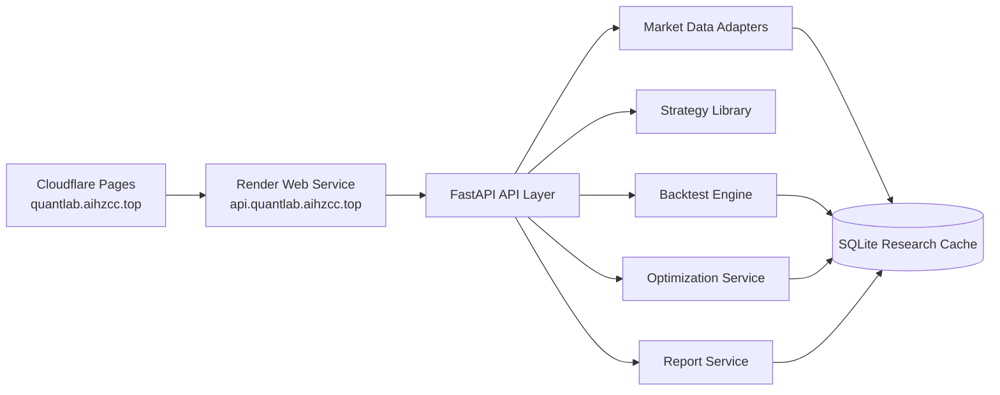

# QuantLab 智能量化投研与回测平台

QuantLab 是一套面向企业内部投研、策略验证和量化实验管理的 Web 化量化研究平台。平台已采用前后端分离的公网部署架构：前端运行在 Cloudflare Pages，后端 FastAPI 服务运行在 Render Web Service，并通过独立 API 域名对外提供服务。

平台围绕“研究对象建立 → 策略验证 → 风险评估 → 参数优化 → 研究报告”形成闭环，帮助投研团队把一次策略研究从临时验证升级为可复盘、可追溯、可演示的研究资产。

## 生产环境

| 模块 | 地址 | 说明 |
| --- | --- | --- |
| Web 应用 | [https://quantlab.aihzcc.top](https://quantlab.aihzcc.top) | Cloudflare Pages 承载的线上前端入口 |
| API 服务 | [https://api.quantlab.aihzcc.top](https://api.quantlab.aihzcc.top) | Render 承载的后端 API 域名 |
| API 健康检查 | [https://api.quantlab.aihzcc.top/api/strategies](https://api.quantlab.aihzcc.top/api/strategies) | 用于验证后端服务可用性 |
| 代码仓库 | [https://github.com/hhzz-svg/QuantLab](https://github.com/hhzz-svg/QuantLab) | 前后端与部署配置统一托管 |

线上前端通过 `VITE_API_BASE_URL=https://api.quantlab.aihzcc.top` 连接 Render 后端；当后端不可用时，前端仍保留静态演示兜底，避免公开访问入口直接失效。

## 企业级价值

- **统一研究流程**：将标的选择、策略配置、回测执行、风险评估、参数实验和报告输出整合在同一工作台。
- **沉淀研究证据链**：每次回测保留参数、交易、权益曲线、指标和报告，便于复盘、展示和横向比较。
- **降低策略验证成本**：内置常用策略模板和参数网格，让研究人员快速完成从想法到结果的第一轮验证。
- **支持线上演示和交付**：前端、后端、API 域名和健康检查均已公网化，适合项目展示、评审汇报和持续迭代。
- **保留扩展路径**：当前使用 SQLite 满足轻量研究与演示，后续可平滑替换为托管数据库以支撑更强的数据持久化和协作能力。

## 核心能力

| 能力域 | 业务能力 | 当前实现 |
| --- | --- | --- |
| 研究对象建立 | 选择常用标的或手动输入代码，生成研究视图 | 美股、A 股、ETF 标的入口，支持行情预览 |
| 数据管理 | 在线数据、本地缓存和 CSV 导入统一接入 | yfinance、AKShare、CSV、SQLite 缓存 |
| 策略验证 | 快速验证典型交易逻辑 | 双均线、RSI、MACD、布林带、定投、动量策略 |
| 回测分析 | 输出收益、回撤、波动、交易和基准对比 | 事件驱动回测引擎与风险收益指标体系 |
| 参数优化 | 批量比较策略参数组合 | 针对 6 类策略的参数网格模板 |
| 研究报告 | 导出可复盘的研究结果 | Markdown/HTML 报告、历史任务记录 |
| 可视化展示 | 面向业务人员展示策略表现 | ECharts 图表、权益曲线、回撤和月度收益 |

## 架构概览



## 技术栈

- **后端**：FastAPI、SQLAlchemy、SQLite、Pandas、NumPy、yfinance、AKShare。
- **前端**：Vue 3、Vite、ECharts。
- **部署**：Render Web Service 承载后端，Cloudflare Pages 承载前端，Cloudflare DNS 管理自定义域名。
- **交付配置**：`render.yaml` 管理后端构建、启动命令和运行环境变量。

## 项目结构

```text
backend/   FastAPI 服务、策略库、数据适配器、回测引擎和报告服务
frontend/  Vue 3 前端应用、研究工作台和可视化界面
docs/      需求、架构、API、测试、部署和使用说明
tests/     后端能力、部署配置、文档一致性和前端文案回归测试
```

## 线上部署

当前线上架构已经完成：

1. GitHub 仓库作为 Render 和 Cloudflare Pages 的统一部署源。
2. Render Web Service 运行 `uvicorn backend.main:app --host 0.0.0.0 --port $PORT`。
3. Cloudflare Pages 前端生产环境配置 `VITE_API_BASE_URL=https://api.quantlab.aihzcc.top`。
4. 自定义域名 `api.quantlab.aihzcc.top` 指向 Render 后端服务。

完整部署配置见 [`docs/07-部署说明.md`](docs/07-部署说明.md)。

## 本地运行

```powershell
cd D:\QuantLab\quant-backtest-system
python -m pip install -r requirements.txt
npm install
npm run build
uvicorn backend.main:app --reload
```

访问：

- 本地应用：[http://127.0.0.1:8000/](http://127.0.0.1:8000/)
- API 文档：[http://127.0.0.1:8000/docs](http://127.0.0.1:8000/docs)

## 常用接口

- `GET /api/market-data/preview?symbol=AAPL&data_source=auto`：生成研究对象预览。
- `POST /api/market-data/sync`：把研究数据缓存到 SQLite。
- `POST /api/market-data/upload`：导入本地 CSV 研究数据。
- `GET /api/strategies`：获取策略库和参数说明。
- `POST /api/backtests`：创建回测任务。
- `GET /api/backtests/{id}`：查看回测详情。
- `GET /api/backtests/{id}/report?format=markdown|html`：导出研究报告。
- `POST /api/optimizations`：运行参数网格优化。

## 验证命令

```powershell
python -m pytest -q
python -m compileall backend -q
npm run build
```

## 当前边界

QuantLab 当前定位为量化研究、策略验证和项目展示平台，不包含实盘交易、券商接口、真实资金管理、分钟级高频交易和多用户权限体系。若用于生产级团队协作，建议后续补充托管数据库、身份认证、权限控制、审计日志和任务队列。
