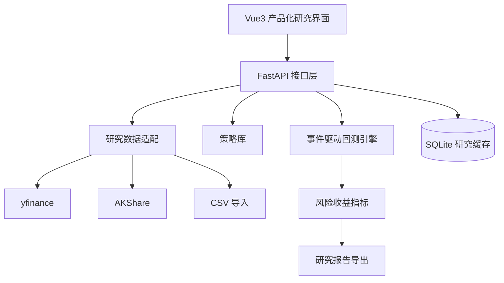

# 02 架构设计



## 当前交互架构

界面分为两套外壳：首页使用门户外壳（顶部导航、无侧边栏）对外说明产品；其余页面使用工作台外壳（左侧分组导航 + 顶栏状态区），面向实际研究操作。详细设计规范见 [`09-UI重设计方案.md`](09-UI重设计方案.md)。

- 首页说明平台定位、标准研究流程、策略模板与一次回测能得到的完整成果形态，并提供快速创建研究任务的入口。
- 研究工作台把配置分为研究对象、区间与成本、策略与参数、下单方式四组，右侧同步展示标的快照与走势预览。
- 结果分析页自上而下呈现配置摘要、10 项收益/风险/交易指标、价格与买卖点、权益对比与回撤、月度收益，以及交易明细与订单流水两张明细表。
- 回测记录页以研究台账形式横向比较历史回测的收益、回撤、夏普与交易次数。
- 参数优化页提供可视化参数网格编辑器与 JSON 高级模式，输出收益–回撤散点图和完整排行榜。
- 策略库集中展示 6 类策略的逻辑、信号、参数、适用场景、回测解读和产品展示要点。
- 数据管理页负责本地缓存查看和自定义 CSV 导入，作为自有数据、离线数据入口。
- 图表采用 ECharts 按需引入：研究对象走势、买卖点、权益/基准对比、回撤、月度收益、优化散点，统一使用十字光标与区间缩放。

## 前端模块结构

```text
frontend/src/
  main.js          应用入口
  App.vue          外壳切换（门户 / 工作台）
  store.js         应用状态与业务动作，页面组件不各自持有业务状态
  api.js           请求封装、错误解析、演示兜底与冷启动标记
  format.js        百分比、金额、价格、日期的统一格式化
  charts.js        ECharts 按需注册与统一图表配置
  preferences.js   涨跌配色偏好
  styles/          设计变量、基础排版、组件样式
  components/      外壳与通用组件
  pages/           首页与六个工作台页面
```
