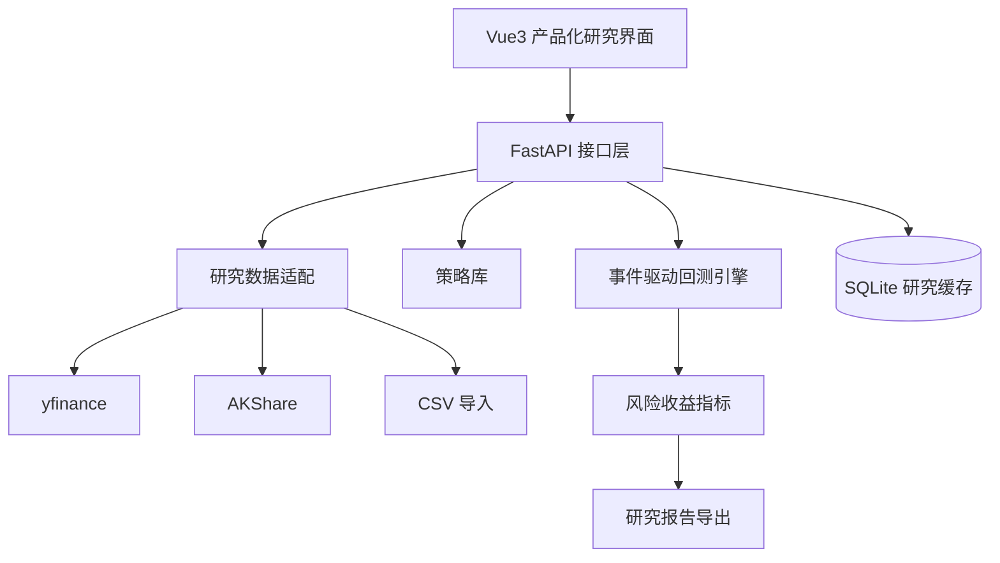

# 02 架构设计

## 当前交互架构

- 首页面向学生和评审，先说明研究对象建立、策略验证、风险评估与成果展示的完整闭环。
- “开始研究”页提供常用标的点选和手动输入两种方式，降低演示和答辩时的准备成本。
- 策略库集中展示 6 类策略的逻辑、信号、参数、适用场景、回测解读和论文展示要点。
- 回测结果页展示价格走势、买卖点、策略权益、买入持有基准、回撤曲线和月度收益。
- 参数优化页通过策略对应的参数网格批量运行回测，并输出收益、回撤和排名结果。
- 数据管理页负责本地缓存查看和自定义 CSV 导入，作为课程数据、离线数据或演示数据入口。
- 图表采用 ECharts：研究对象走势、买卖点、权益/基准对比、回撤、月度收益、优化散点。
