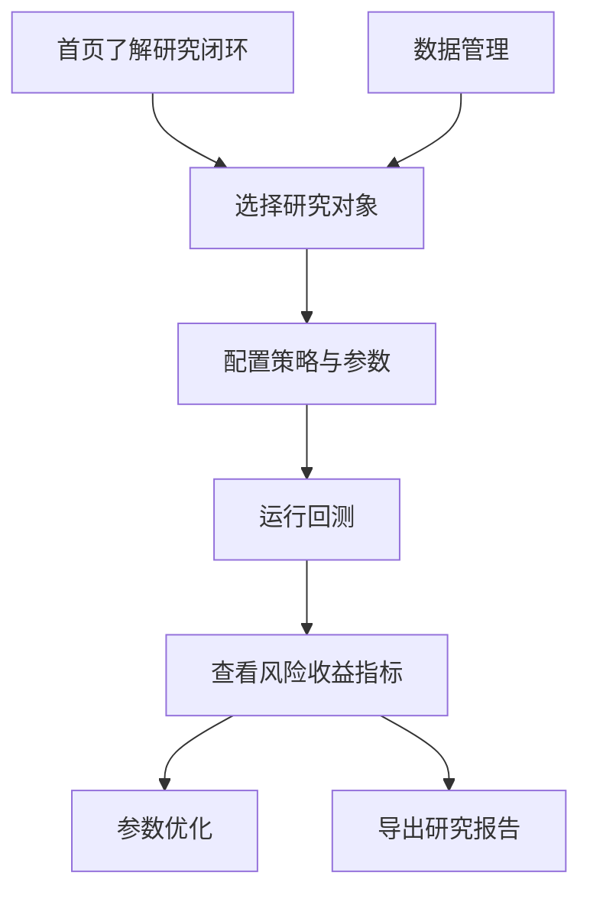

# QuantLab 使用说明

## 系统边界

当前版本面向个人投资研究、策略验证和风险复盘，重点保证一次量化研究能够被配置、运行、复盘和说明。系统不包含实盘交易、券商接口、分钟级高频、多用户权限和真实资金管理。

## 推荐流程



1. 在首页确认平台能力和研究流程。
2. 进入“开始研究”，点选常用标的或手动输入代码。
3. 选择策略、区间、初始资金、手续费和滑点。
4. 运行回测后查看价格走势、买卖点、权益曲线、回撤和月度收益。
5. 如需做参数实验，进入“参数优化”选择策略对应的参数网格。
6. 在“研究报告”中查看历史任务并下载 Markdown 或 HTML 报告。
7. 如需使用自定义数据，在“数据管理”中导入本地 CSV。

## 常用接口

| 接口 | 方法 | 作用 |
| --- | --- | --- |
| `/api/market-data/preview` | GET | 生成研究对象预览、报价摘要和走势图数据 |
| `/api/market-data` | GET | 查看本地研究数据缓存摘要 |
| `/api/market-data/sync` | POST | 将研究数据同步到 SQLite 缓存 |
| `/api/market-data/upload` | POST | 导入本地 CSV 研究数据 |
| `/api/strategies` | GET | 获取策略库和参数说明 |
| `/api/backtests` | POST | 创建回测任务 |
| `/api/backtests` | GET | 查看历史回测列表 |
| `/api/backtests/{id}` | GET | 查看单次回测详情 |
| `/api/backtests/{id}/report` | GET | 下载 Markdown 或 HTML 报告 |
| `/api/optimizations` | POST | 创建参数优化任务 |
| `/api/optimizations/{id}` | GET | 查看参数优化详情 |

## 回测请求示例

```json
{
  "symbol": "AAPL",
  "asset_type": "stock",
  "data_source": "auto",
  "start": "2024-01-01",
  "end": "2025-12-31",
  "strategy_id": "ma_cross",
  "strategy_params": { "short_window": 5, "long_window": 20 },
  "cash": 100000,
  "fee": 0.001,
  "slippage": 0.001,
  "benchmark": "buy_hold"
}
```

## 验证方式

```powershell
python -m pytest -q
python -m compileall backend -q
npm run build
```
